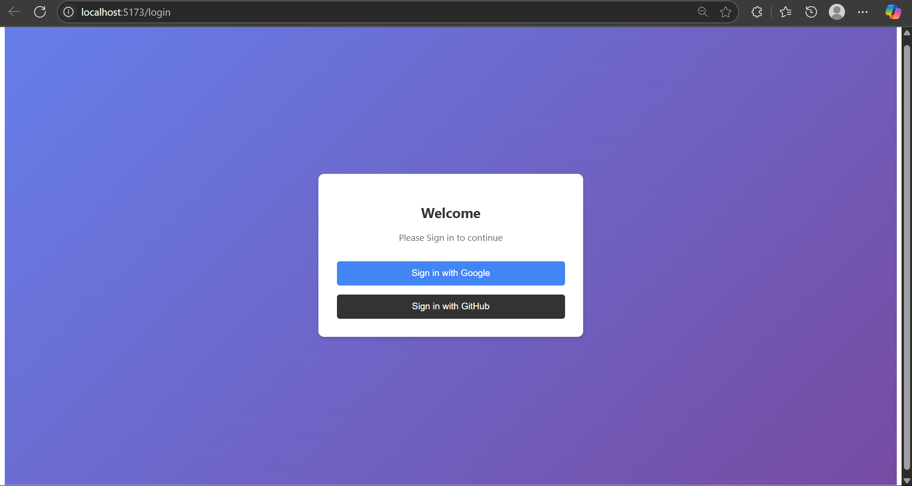
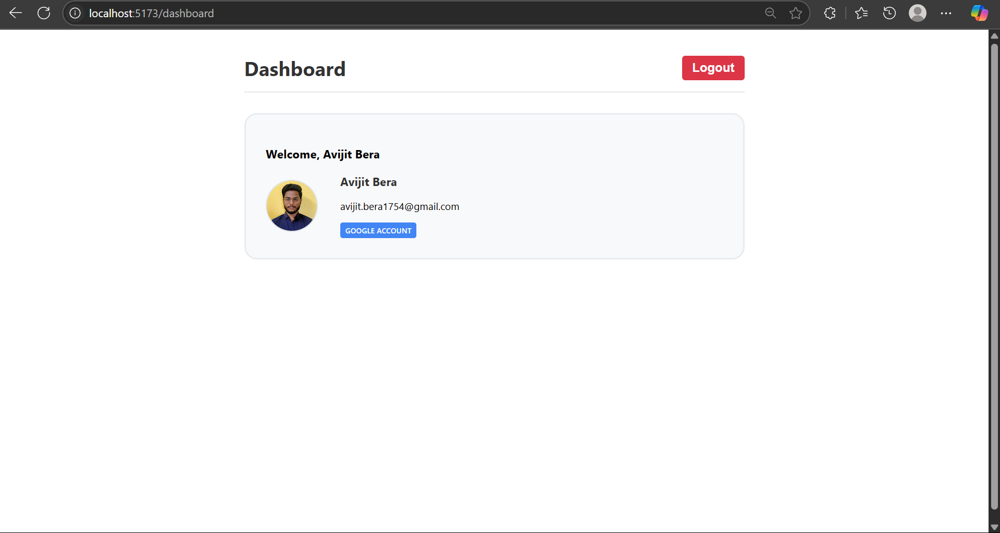
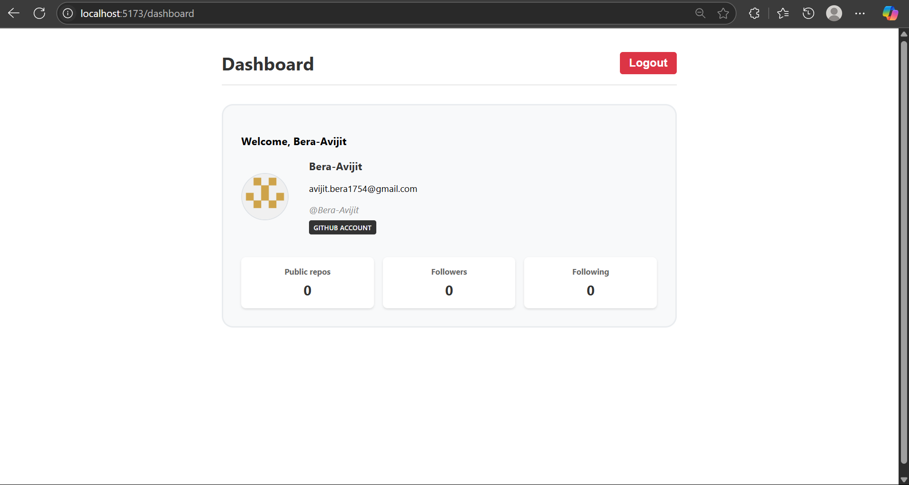

# 🔐 OAuth Authentication App with Spring Boot + React

A full-stack web application featuring secure **OAuth2 authentication** with **Google** and **GitHub**, built using:

- ✅ Spring Boot (Java backend)
- ⚛️ React (frontend)
- 🐬 MySQL (database)
- 🔐 Spring Security OAuth2
- 🌐 Secure CORS + Cookie-based session handling

---
## 📸 Screenshots

### 🔐 Login Page

## 📊 Dashboard
### Google

### GitHub

---

## 🚀 Features

- 🌍 Login with **Google** and **GitHub**
- ✅ OAuth2 with secure session handling (no tokens!)
- 👤 User dashboard with profile info
- 🍪 Secure, cross-origin `JSESSIONID` cookies
- 📦 Full-stack integration (Spring Boot + React)
- 🔐 Logout + session cleanup
- 📄 Clean, readable code and structure

---

